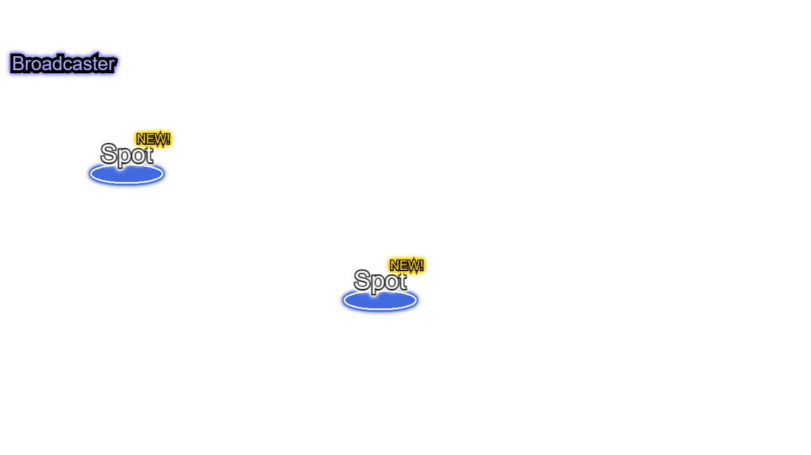

# 訪問先を追加する

訪問先 (`Spot`) は生放送イベントと紐づく個性豊かなスポットです.

ここでは独自の `Spot` を追加する方法を説明します.

## 組み込みの `LiveOnAirScene` を使用している場合

`LiveOnAirScene` を利用している場合は、 `LiveOnAirSceneBuilder` で初期化する際に `Spot` の設定情報を定義します.

### `Spot` を作成する

`spot(<属性値>)` メソッドを実行することで指定した属性値を持つ `Spot` を作成できます.
また複数回呼び出すことで複数の `Spot` を定義できます.
以下は座標(100,150)と(500,350)にそれぞれ `Spot` を作成します.

```typescript
  const scene = new LiveOnAirSceneBuilder(g.game)
    .spot({ x: 100, y: 150 })
    .spot({ x: 500, y: 350 })
    .build();
  g.game.pushScene(scene);
```

[コード全文](https://github.com/yasshi2525/live-on-air/blob/main/sample/src/add.spot.builtin.ts)



### 設定した `Spot` の属性値を取得する

定義した情報は引数のない `spot()` メソッドを呼び出すことで取得できます.

```diff typescript
-   const scene = new LiveOnAirSceneBuilder(g.game);
+   const builder = new LiveOnAirSceneBuilder(g.game)
      .spot({ x: 100, y: 150 })
-     .spot({ x: 500, y: 350 })
+     .spot({ x: 500, y: 350 });
-     .build();
+   // 定義情報の取得
+   // = [{ x: 100, y: 150, ... }, { x: 500, y: 350, ... }]
+   console.log(builder.spot());
+   const scene = builder.build();
    g.game.pushScene(scene);
```

[コード全文](https://github.com/yasshi2525/live-on-air/blob/main/sample/src/add.spot.refer.builtin.ts)

## 独自の `g.Scene` を利用している場合

独自の `g.Scene` を利用している場合は、 `SpotBuilder` を用いて作成します.

### `Spot` を作成する.

`SpotBuilder` の各メソッドを実行することで指定した属性値を持つ `Spot` を作成できます.
たとえば `location({ x: 100, y: 150 })` を実行すると初期位置を設定できます.
そして、 `build()` を実行するとこれまで設定した属性値を持った `Spot` が作成されます.

```typescript
    const spot1: Spot = new SpotBuilder(scene)
      .location({ x: 100, y: 150 })
      .build()
    const spot2: Spot = new SpotBuilder(scene)
      .location({ x: 500, y: 350 })
      .build();
```

`Spot` は動作のために `Field`, `Screen` と紐づける必要があります.
`Spot` のメソッド `deployOn(Field)`, `attach(Screen)` を実行するか、
`Field`, `Screen` の `addSpot(Spot)` を実行してください.

```diff typescript
      const field: Field = new FieldBuilder().build();
      const screen: Screen = new ScreenBuilder(scene).build();
+     // 紐づけ方法1 
+     spot1.deployOn(field);
+     spot1.attach(screen);
+     // 紐づけ方法2
+     field.addSpot(spot2);
+     screen.addSpot(spot2);
```

[コード全文](https://github.com/yasshi2525/live-on-air/blob/main/sample/src/add.spot.migrate.ts)


### 設定した `Spot` の属性値を取得する

`SpotBuilder` の各メソッドを実行することで、設定した属性値を確認できます.

```diff typescript
      const builder = new SpotBuilder(scene);
-     const spot1: Spot = new SpotBuilder(scene)
-       .location({ x: 100, y: 150 })
-       .build();
+     builder.location({ x: 100, y: 150 });
+    // 定義情報の取得
+    // = { x: 100, y: 150 }
+    console.log(builder.location());
+    const spot1: Spot = builder.build();
```

[コード全文](https://github.com/yasshi2525/live-on-air/blob/main/sample/src/add.spot.refer.migrate.ts)
