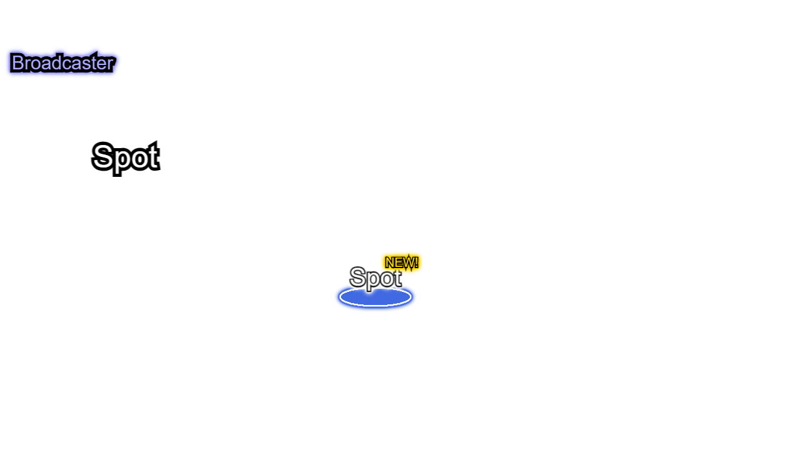
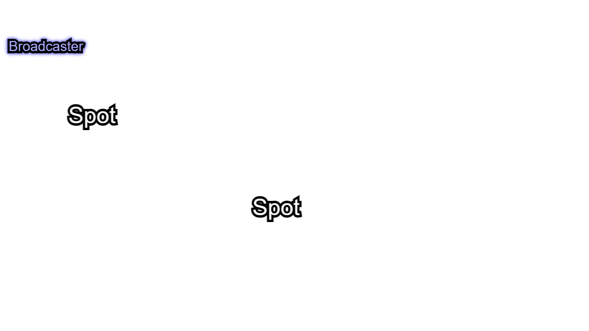
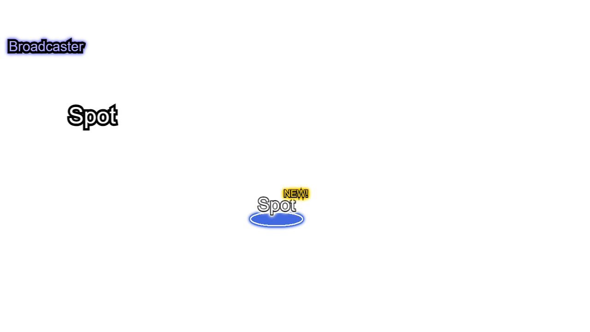

訪問先 (`Spot`) の表示画像を変更する方法を説明します.

## 4つの画像の状態

訪問先は状態によって4種類の画像を切り替えて表示されます.
独自の画像にする場合、下記4つすべての画像を用意してください.
特に表示を切り替える必要がなければ、同一の画像を4つのファイル名にしてください.

### 'locked' 未解放状態

存在することは分かるが、条件をみたすまでは訪問できない `Spot`.
前提 `Spot` を攻略すると訪問できるようになります.
ロックがかかっていることが分かる画像を指定してください.

何も指定しない場合、下記の画像が使われます.


### 'unvisited' 未訪問状態

訪問可能だが、プレイヤーがまだ訪問していない `Spot`.
強調する画像を指定すると、プレイヤーに訪問を促せます.

何も指定しない場合、下記の画像が使われます.


### 'normal' 訪問可能状態

プレイヤーが選択すると訪問できる `Spot`.
通常状態の画像を指定してください.

何も指定しない場合、下記の画像が使われます.


### 'disabled' 訪問操作受付禁止状態

プレイヤーが選択しても訪問できない `Spot`
放送者が他のスポットに向かって移動している最中や生放送中にこの状態に遷移します.
訪問できないことが分かる画像を指定してください.

何も指定しない場合、下記の画像が使われます.


## 組み込みの `LiveOnAirScene` を使用している場合

### 訪問先ごとに画像を指定する

`LiveOnAirSceneBuilder` で `Spot` を初期化する際に画像を指定します.

`spot(<引数>)` の引数の `locked`, `unvisited`, `normal`, `disabled` に `g.ImageAsset` を指定してください.

```diff typescript
    const scene = new LiveOnAirSceneBuilder(g.game)
-     .spot({ x: 100, y: 150 })
+     .spot({
+       x: 100,
+       y: 150,
+       locked: g.game.asset.getImageById('spot.custom.locked'),
+       unvisited: g.game.asset.getImageById('spot.custom.unvisited'),
+       normal: g.game.asset.getImageById('spot.custom.normal'),
+       disabled: g.game.asset.getImageById('spot.custom.disabled')
+     })
      .spot({ x: 500, y: 350 })
      .build();
    g.game.pushScene(scene);
```

> [!NOTE]
> `g.ImageAsset` として指定するために、画像アセットはグローバルアセットにしてください. ([参考](https://akashic-games.github.io/reverse-reference/v3/asset/global-asset.html))

[コード全文](https://github.com/yasshi2525/live-on-air/blob/main/sample/src/customize.spot.builtin.ts)

左上の `Spot` の画像が変更されました.



### 一括で画像を指定する

複数の `Spot` を作る場合で、すべてに同じ画像を適用する際は `LiveOnAirSceneBuilder.getDefault(g.game)` を使うと便利です.
`spot()` メソッドを使って、デフォルトで使われる画像を指定できます.

```diff typescript
+   LiveOnAirSceneBuilder.getDefault(g.game)
+     .spot({
+       locked: g.game.asset.getImageById('spot.custom.locked'),
+       unvisited: g.game.asset.getImageById('spot.custom.unvisited'),
+       normal: g.game.asset.getImageById('spot.custom.normal'),
+       disabled: g.game.asset.getImageById('spot.custom.disabled')
+     });
    const scene = new LiveOnAirSceneBuilder(g.game)
-     .spot({
-       x: 100,
-       y: 150,
-       locked: g.game.asset.getImageById('spot.custom.locked'),
-       unvisited: g.game.asset.getImageById('spot.custom.unvisited'),
-       normal: g.game.asset.getImageById('spot.custom.normal'),
-       disabled: g.game.asset.getImageById('spot.custom.disabled')
-     })
+    .spot({ x: 100, y: 150 })
     .spot({ x: 500, y: 350 })
    .build();
```

[コード全文](https://github.com/yasshi2525/live-on-air/blob/main/sample/src/customize.default.spot.builtin.ts)

2つとも画像が変更されました.



## 独自の `g.Scene` を利用している場合

`SpotBuilder` で `Spot` を初期化する際に画像を指定します. `image()` の引数に画像アセットを指定してください.

```diff typescript
      const spot1: Spot = new SpotBuilder(scene)
        .location({ x: 100, y: 150 })
+       .image({
+         locked: scene.asset.getImageById('spot.custom.locked'),
+         unvisited: scene.asset.getImageById('spot.custom.unvisited'),
+         normal: scene.asset.getImageById('spot.custom.normal'),
+         disabled: scene.asset.getImageById('spot.custom.disabled')
+       })
        .build();
```

> [!NOTE]
> `LiveOnAirScene` を使わない場合、画像アセットはグローバルアセットでなくとも構いません.

[コード全文](https://github.com/yasshi2525/live-on-air/blob/main/sample/src/customize.spot.migrate.ts)

左上の `Spot` の画像が変更されました.



### 一括で画像を指定する

複数の `Spot` を作る場合で、すべてに同じ画像を適用する際は `SpotBuilder.getDefault()` を使うと便利です.
`image()` メソッドを使って、デフォルトの画像を指定できます.

```diff typescript
+     SpotBuilder.getDefault(scene)
+       .image({
+         locked: scene.asset.getImageById('spot.custom.locked'),
+         unvisited: scene.asset.getImageById('spot.custom.unvisited'),
+         normal: scene.asset.getImageById('spot.custom.normal'),
+         disabled: scene.asset.getImageById('spot.custom.disabled')
+       });
      const spot1: Spot = builder
        .location({ x: 100, y: 150 })
-       .image({
-         locked: scene.asset.getImageById('spot.custom.locked'),
-         unvisited: scene.asset.getImageById('spot.custom.unvisited'),
-         normal: scene.asset.getImageById('spot.custom.normal'),
-         disabled: scene.asset.getImageById('spot.custom.disabled')
-       })
        .build();
```

[コード全文](https://github.com/yasshi2525/live-on-air/blob/main/sample/src/customize.default.spot.migrate.ts)

2つとも画像が変更されました.


