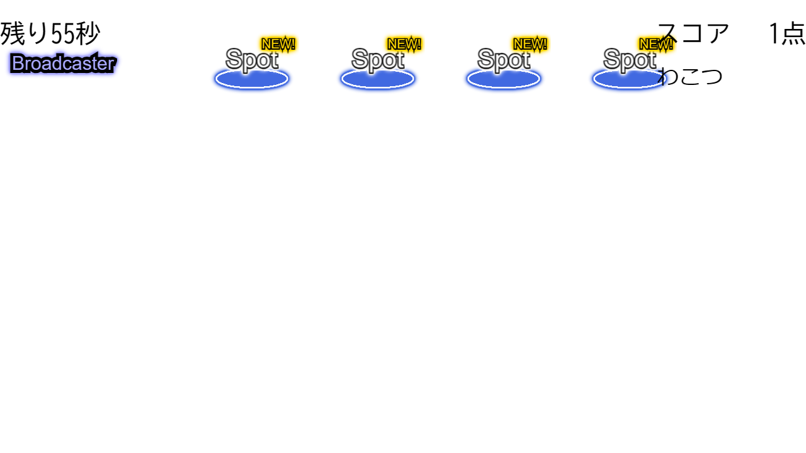

# 使ってみる

## Akashic Engine プロジェクトを構築する

Akashic Engine の公式ページを参考にプロジェクトを作成してください.  

> [!WARNING]
> live-on-air はランキング形式のニコ生ゲーム向けに作られています.
> マルチプレイには対応していないのでご注意ください.

> [!TIP]
> 言語は javascript でも開発できますが、 Typescript の利用を推奨します.
> 型情報が利用できるため、補完機能を使って効率的にコーディングを進められるためです.

## live-on-air のインストール

プロジェクトルートフォルダ (`game.json` のある場所) をカレントディレクトリとして、以下のコマンドを実行してください.

```shell
npx akashic install @yasshi2525/live-on-air
```

> [!NOTE]
> `@akashic/akashic-cli` をグローバルインストールしている環境ならば
> `npx` の記述は不要です

コマンドを実行すると `game.json` に以下の記述が追加されます.  

> [!NOTE]
> 追加される記述はどれもゲーム構築時には使わないものなので、
> 確認しなくとも問題ありません.

* 画像アセットファイル
* ライブラリコード

> [!TIP]
> 画像アセットファイルは特に画像アセットをカスタマイズしなかったとき、
> デフォルトで使用されるものです.  
> live-on-air は画像ファイルも提供するので、
> 自身で画像を用意しなくとも、すぐにゲームを構築できます.

```json5
{
  "assets": {
    // 画像アセットファイル
    "node_modules/@yasshi2525/live-on-air/image/default.png": {
      "type": "image",
      "path": "node_modules/@yasshi2525/live-on-air/image/default.png",
      "width": 181,
      "height": 96,
      "global": true
    },
    // ...
    "globalScripts": [
      // ライブラリコード
      "node_modules/@yasshi2525/live-on-air/lib/index.js",
      // ...
    ],
    "moduleMainScripts": {
      // ライブラリコード
      "@yasshi2525/live-on-air": "node_modules/@yasshi2525/live-on-air/lib/index.js",
      // ...
    }
  }
}
```

> [!NOTE]
> 上記は出力例です. 細かなパスや値は変わることがあります.
> また Akashic Engine の仕様変更により、項目が変わる可能性があります.

## main() を実装する

live-on-air は構築済みのゲーム基盤を提供します.
ゲームのメイン要素である g.Scene を取得するだけでゲームが動作します.

`main.ts`

```typescript
import { GameMainParameterObject } from './parameterObject';
import { LiveOnAirSceneBuilder } from '@yasshi2525/live-on-air';

export const main = (param: GameMainParameterObject): void => {
  g.game.vars.gameState = { score: 0 };
  g.game.random = param.random;
  
  const scene = new LiveOnAirSceneBuilder(g.game)
    .spot({ x: 300, y: 0 })
    .spot({ x: 500, y: 0 })
    .spot({ x: 700, y: 0 })
    .spot({ x: 900, y: 0 })
    .build();
  g.game.pushScene(scene);
};
```

[コード全文](getting.started.ts)

> [!NOTE]
> 上記は live-on-air のもっとも簡単な使い方の一例です.
> カスタマイズ方法は後ほど紹介します.

> [!TIP]
> 上記は放送者（プレイヤー）が訪問すると生放送イベントが発生するスポット（`Spot`）と呼んでいる構成要素を
> 横一列に4個並べた状態でゲームを起動します. 具体的な内容は後ほど説明します.

## ゲームの起動

下記コマンドを利用してゲームスクリプトをビルドしてください.

```shell
npm run build
```

もし `package.json` に npmスクリプトが組まれていない場合は、
代わりに下記を実行してください.

```shell
npx tsc
npx akashic scan asset script
```

sandbox 環境を起動することで、ゲームの動作確認ができます.

```shell
npx akashic sandbox
```

下記はゲーム画面の出力例です.



> [!TIP]
> 画面上のスポットをクリックしてみてください.
> 放送者（プレイヤー）が移動し、生放送イベントが開始する様子が確認できるはずです.  

生放送イベントは自作したイベントにカスタマイズできます.  
背景、放送者（プレイヤー）、スポットの画像を差し替えることでオリジナルゲームが簡単に作れます.

## (補足) アップデート方法

再インストールすることで最新版がインストールされます.

```shell
npx akashic uninstall @yasshi2525/live-on-air
npx akashic install @yasshi2525/live-on-air
```

## (補足) アンインストール方法

下記コマンドを実行することでライブラリは削除され、 `game.json` も元の記述に戻ります.

```shell
npx akashic uninstall @yasshi2525/live-on-air
```
